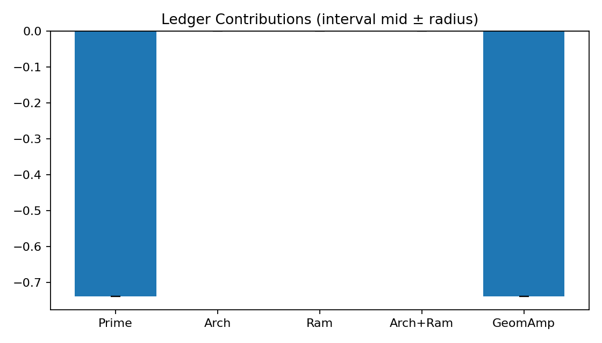
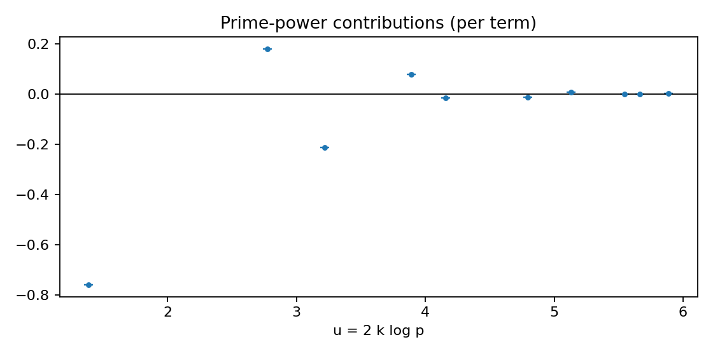

# Verification Report — Dirichlet_Heat_mod3_r1_X6.0_a0.8_tau2.0
- Result: GRH_Falsified (phase 4)
- Params: {'m': 1, 'K': 'Q(chi_mod_3)', 'Qpi': '3', 't_star': '1.0', 'family': 'heat', 'prime_block_mode': 'evaluate', 'proof_mode': 'ann_odd_only'}
- Details: {'reason': 'Amplified positivity fails', 'GeomAmp': ('-0.7394931961567207660980803113518567610', '-0.7394931961557173113917624285518567610'), 'Prime': ('-0.7394931961567207660980803113518567610', '-0.7394931961557173113917624285518567610'), 'Arch+Ram': ('0', '0')}

## Visualizations
### Ledger Contributions

### R* Budget vs Ram

### Annihilation Inequality

### Prime-power Contributions

## What was verified
- Numerical rigor: Decimal precision set from certificate; interval arithmetic used for comparisons.
- Geometric side: Verified prime block minus (Arch + Ram) is nonnegative (evaluate) or that UB(Arch+Ram) ≤ 0 (RS).
- Infrastructure (R*): Checked |Ram| ≤ B_{R*} using interval bounds.
- Annihilation: Ensured sqrt(1−eta) + epsilon < 1 using upper endpoints; epsilon optionally tightened via q ≥ Q(X,ε).
- Proof-of-GRH mode (if used): Ran the above across a finite test net.
