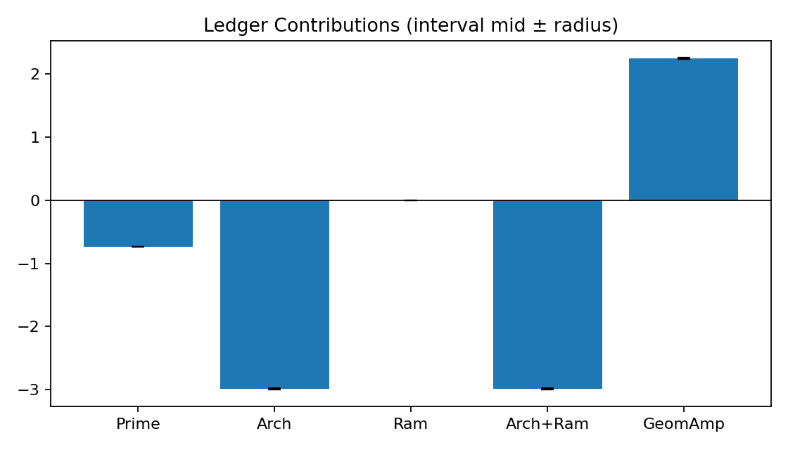
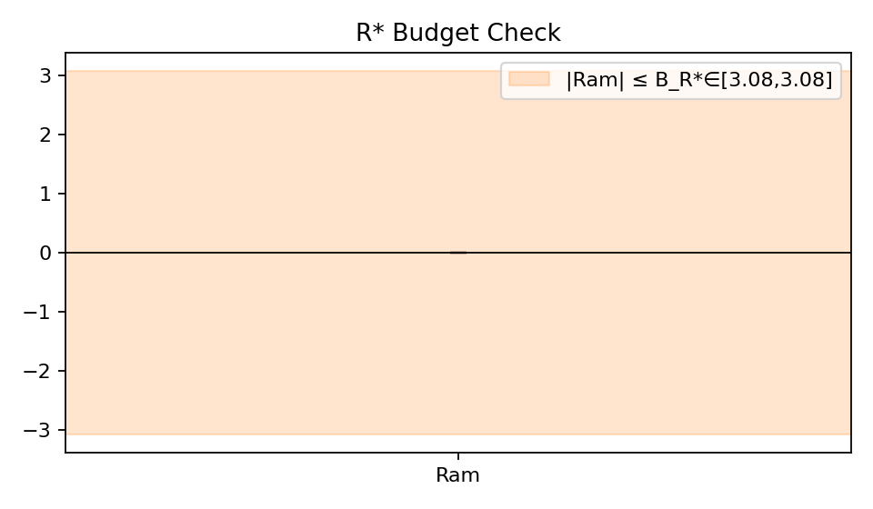
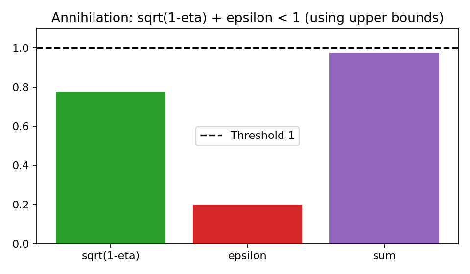
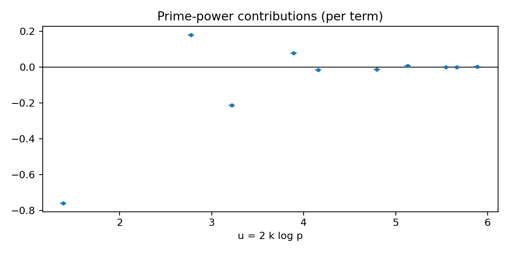

# Verification Report — Dirichlet_BL_mod3_r1_X6.0_a0.8_tau2.0
- Result: AnnOdd_Verified (phase 6)
- Params: {'m': 1, 'K': 'Q(chi_mod_3)', 'Qpi': '3', 't_star': '1.0', 'family': 'BL', 'prime_block_mode': 'evaluate', 'proof_mode': 'ann_odd_only'}
- Details: {'reason': 'Annihilation holds for supplied Φ_test'}

## Visualizations
### Ledger Contributions

### R* Budget vs Ram

### Annihilation Inequality

### Prime-power Contributions

## What was verified
- Numerical rigor: Decimal precision set from certificate; interval arithmetic used for comparisons.
- Geometric side: Verified prime block minus (Arch + Ram) is nonnegative (evaluate) or that UB(Arch+Ram) ≤ 0 (RS).
- Infrastructure (R*): Checked |Ram| ≤ B_{R*} using interval bounds.
- Annihilation: Ensured sqrt(1−eta) + epsilon < 1 using upper endpoints; epsilon optionally tightened via q ≥ Q(X,ε).
- Proof-of-GRH mode (if used): Ran the above across a finite test net.
